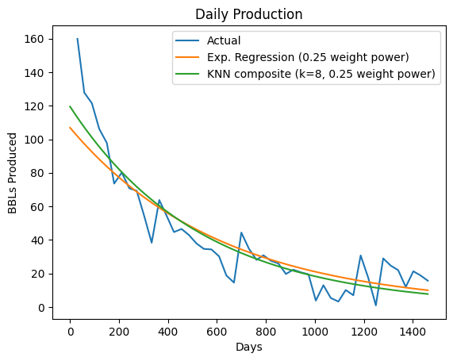

# Oil Production Prediction Model

This model combines __exponential regression__ with __K-nearest neighbors__ to predict the quantity of oil production from wells drilled in an area of northern Colorado. Without access to proprietary geological data, it uses exclusively public data downloaded or scraped from Colorado's [official ECMC website](https://ecmc.state.co.us/).

In the example below, the orange curve is an exponential regression that was trained on this well's own data (included for reference). The green curve is a composite of 8 other exponential regressions trained on nearby wells.

## Demo Notebook

Check out [this demo notebook](demo/demo.ipynb) to see how it works, including hyperparameter tuning.
